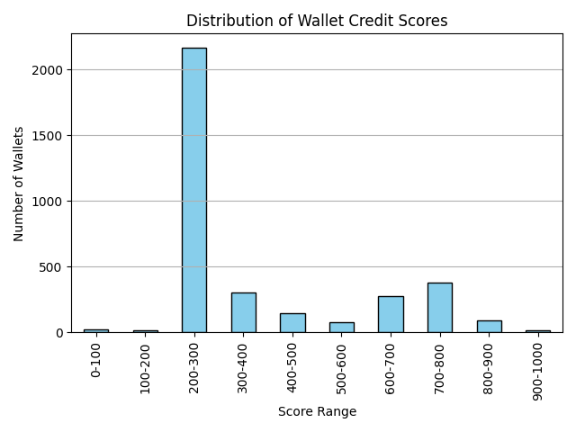

# 📊 Credit Score Analysis of Wallets (Aave V2 Protocol)

This document presents an analysis of the credit scores assigned to user wallets based on their historical DeFi transaction behavior on the Aave V2 protocol.

## 🎯 Objective

We aimed to generate a credit score between **0 and 1000** for each wallet using features like:
- Number of borrows/repays/liquidations
- Repayment ratio
- Deposit behavior
- Active days and transaction recency
- Most used and unique assets

A higher score indicates a more responsible and reliable DeFi user.

---

## 🧠 Score Distribution & Behavior Summary

We segmented wallets into score ranges and analyzed their behavior:

| Score Range | Num Borrows | Num Deposits | Repaid % | Liquidation Ratio | Active Days | Days Since Last Tx |
|-------------|-------------|---------------|-----------|---------------------|--------------|----------------------|
| **0–100**   | 2.45        | 2.82          | 0.02      | **1.39**            | 4.05         | 1468.5               |
| **100–200** | 8.44        | 10.31         | 0.03      | 0.32                | 5.94         | 1469.4               |
| **200–300** | 1.43        | 4.56          | 0.06      | 0.00                | 3.03         | 1464.3               |
| **300–400** | 8.20        | 21.04         | 0.28      | 0.01                | 10.61        | 1462.4               |
| **400–500** | 13.94       | 25.94         | 0.71      | 0.03                | 17.41        | 1442.2               |
| **500–600** | 18.07       | 29.48         | 1.03      | 0.07                | 19.15        | 1444.3               |
| **600–700** | 10.66       | 22.19         | 1.03      | 0.01                | 13.67        | 1455.1               |
| **700–800** | 9.89        | 18.40         | 1.00      | 0.00                | 9.93         | 1481.6               |
| **800–900** | 11.22       | 20.83         | 1.05      | 0.01                | 13.48        | 1466.3               |
| **900–1000**| 7.35        | 9.71          | **1.76**  | **0.00**            | 9.18         | 1467.5               |

---

## 🔍 Key Insights

###  Low Score Wallets (0–200)
- Very **low repayment percentage** (0.02–0.03)
- **High liquidation ratio** (up to 1.39)
- Low transaction activity & fewer active days
- Likely risky, bot-like, or abandoned wallets

### Mid Score Wallets (300–600)
- Better **repayment behavior** (0.28–1.03)
- **More deposits and borrows**
- Increasing active days → more engagement

### High Score Wallets (700–1000)
- **No liquidations**
- Repaid more than borrowed (repaid % ≥ 1.0)
- Consistent deposit/borrow patterns
- Moderate to high active days

---

## 📈 Score Distribution Graph

